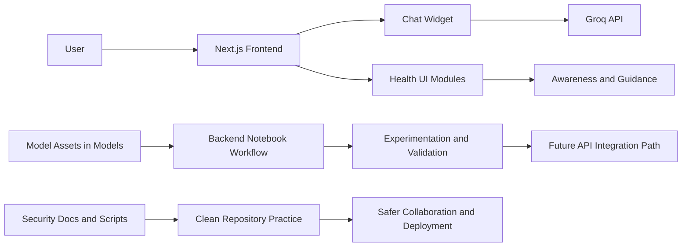

# AyushMitra SIH Internal 2025

AyushMitra is a healthcare-focused decision support and awareness platform built during Internal Smart India Hackathon 2025 at MIT Art, Design and Technology University, Pune.

The project combines:
- An AI-enabled conversational web experience
- Multiple disease prediction and classification model assets
- A notebook-driven backend experimentation workflow
- Security-first handling of API credentials

The core objective is to improve early guidance, triage support, and digital health accessibility through an integrated AI + ML pipeline.

## Why This Project Matters

Healthcare access and early intervention are often delayed by:
- Low awareness of symptoms and risk factors
- Fragmented diagnostic guidance
- Lack of easy-to-use digital triage interfaces

AyushMitra addresses this by connecting conversational AI, disease-specific models, and a user-friendly frontend so users can move from symptom discussion to informed guidance faster.

## What Was Built

### 1. Frontend Experience (Next.js)
- Modern React/Next.js interface in Frontend
- Landing experience with modular sections (Hero, Features, ABDM section)
- Chat assistant with image attachment capability
- Environment-based API key usage for Groq integration

### 2. AI Chat Capability
- Chat widget that sends user conversation context to Groq chat completions API
- Real-time response rendering in UI
- Basic file upload flow for image-supported conversation context

### 3. ML Model Portfolio
Multiple healthcare model folders under Models, including:
- Dengue classifier
- Typhoid fever classifier
- Fever medicine recommendation model
- Liver disease classifier
- Skin disease classifier
- Vector-borne disease classifier

Each model area includes notebook artifacts and metadata (for example feature lists and model metadata files), enabling reproducible experimentation and extension.

### 4. Backend Notebook Workflow
- Unified backend notebook under Backend for experimentation and integration
- Colab-friendly workflow for quick testing and deployment iterations

### 5. Security and Cleanup Utilities
- Environment setup documentation for safe secret management
- Repository-level ignore policies to prevent sensitive files and generated artifacts from being committed

## How The System Connects



## Repository Structure

```text
Ayushmitra-SIH-Ineternal_2025/
├─ Backend/
│  └─ ayushmitra_unified_backend.ipynb
├─ Frontend/
│  ├─ app/
│  ├─ src/
│  ├─ components/
│  ├─ public/
│  └─ package.json
├─ Models/
│  ├─ dengue_classifier/
│  ├─ fever_classifier_typhoid/
│  ├─ fever_medicine_classifier/
│  ├─ liver_classifier/
│  ├─ skin_disease_classifier/
│  └─ vector_borne_classifier/
├─ ENVIRONMENT_SETUP.md
└─ README.md
```

## Quick Start

### Prerequisites
- Node.js 18+
- npm or pnpm
- Python environment for model notebooks (local or Google Colab)

### Frontend Setup

```bash
cd Frontend
npm install
cp .env.example .env.local
```

Edit Frontend/.env.local and set:

```env
NEXT_PUBLIC_GROQ_API_KEY=your_actual_key
```

Run the frontend:

```bash
cd Frontend
npm run dev
```

### Backend and Models
- Open Backend/ayushmitra_unified_backend.ipynb in Jupyter or Google Colab
- Configure secrets as described in ENVIRONMENT_SETUP.md
- Use model folders under Models for training or inference experiments

## Security and Secret Handling

This repository follows a security-first approach:
- No hardcoded API keys in source code
- Environment variable-based frontend secret handling
- Dedicated cleanup and verification scripts for secret incident remediation

Read before deployment:
- ENVIRONMENT_SETUP.md
- MODEL_ASSETS.md

## Repository Hygiene Policy

The repository is configured to keep GitHub clean and professional by excluding:
- Environment and secret files
- Build outputs and dependency folders
- Notebook checkpoints and temporary files
- Heavy model binaries and local experiment outputs

This keeps the repo focused on source, configuration, and reproducible project assets.

## Documentation Index

- README.md: Project overview, architecture, setup, and roadmap
- MODEL_ASSETS.md: Model file policy, tracked vs local-only assets, and reproduction workflow
- ENVIRONMENT_SETUP.md: Environment variable and secret setup

## Current Professionalization Highlights

- Unified documentation baseline
- Security cleanup guidance included
- Clear folder boundaries across Frontend, Backend, and Models
- Ready-to-extend architecture for future API-based model serving

## Suggested Next Improvements

1. Expose notebook logic through a production backend API (FastAPI) for direct frontend consumption
2. Add a model registry and versioning strategy
3. Add CI checks for linting, formatting, and secret scanning
4. Add dataset cards and model cards for each classifier
5. Add automated tests for chat workflows and UI components

## License

This project is released under the MIT License. See LICENSE for details.

## Acknowledgement

Developed as part of Internal Smart India Hackathon 2025 at MIT ADT University, Pune.
